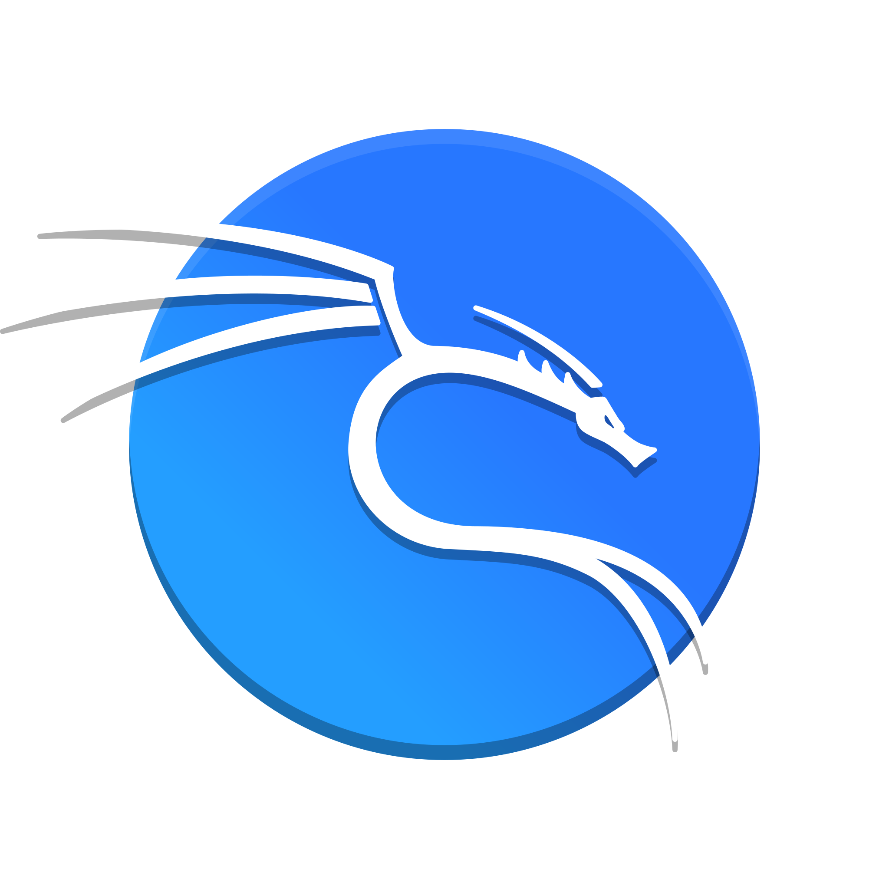

# Hello there 👋 My name is Peeraphat Wongsri (Tungmay).
#### Now I'm a 3rd year computer engineering student, <a href="https://www.chula.ac.th/en/" target="_blank" >Chulalongkorn University</a>.
#### Experienced in Python, Java, C++, SQL (more detail in my repos below ⬇️)
#### Interested in Cyber Security fields (Red Team 🔴).
## Programming Language
       
 
## Tools and Frameworks
      
  
## Contact 📱

<!--
**bananagrill/bananagrill** is a ✨ _special_ ✨ repository because its `README.md` (this file) appears on your GitHub profile.

Here are some ideas to get you started:

- 🔭 I’m currently working on ...
- 🌱 I’m currently learning ...
- 👯 I’m looking to collaborate on ...
- 🤔 I’m looking for help with ...
- 💬 Ask me about ...
- 📫 How to reach me: ...
- 😄 Pronouns: ...
- ⚡ Fun fact: ...
-->
